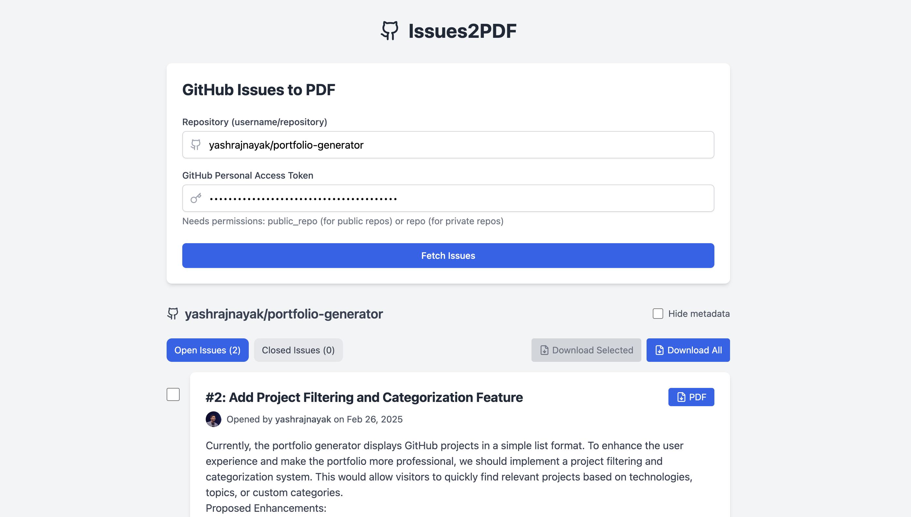

# Issues2PDF

A React application that converts GitHub repository issues into well-formatted PDF documents.



## Features

- 🔍 Browse issues from any public GitHub repository
- 📑 Filter between open and closed issues
- 🏷️ Smart label filtering with multi-select support
- ✅ Select specific issues or download all at once
- 📋 Include/exclude issue metadata in PDFs
- 🎨 Clean and responsive user interface
- 📱 Mobile-friendly design
- 🔒 Secure GitHub token handling
- ⚡ Smart pagination with rate limit handling
- 🔄 Automatic retry on API limits

## Getting Started

### Prerequisites

- Node.js (v14 or higher)
- npm or yarn
- A GitHub Personal Access Token

### Installation

1. Clone the repository:
```bash
git clone https://github.com/yashrajnayak/Issues2PDF.git
cd Issues2PDF
```

2. Install dependencies:
```bash
npm install
# or
yarn install
```

3. Start the development server:
```bash
npm run dev
# or
yarn dev
```

4. Open [http://localhost:5173](http://localhost:5173) in your browser.

### GitHub Token

To use this application, you'll need a GitHub Personal Access Token with the following permissions:
- For public repositories: `public_repo`
- For private repositories: `repo`

You can create a token by following these steps:
1. Go to GitHub Settings > Developer Settings > Personal Access Tokens
2. Click "Generate New Token"
3. Select the required permissions
4. Copy the generated token

Note: The app handles GitHub API rate limits automatically. For authenticated requests, you get:
- 5,000 requests per hour for personal accounts
- 15,000 requests per hour for GitHub Enterprise Cloud organizations

## Usage

1. Enter your GitHub repository in the format `username/repository`
2. Paste your GitHub Personal Access Token
3. Click "Fetch Issues" to load the repository's issues
4. Use the tabs to switch between open and closed issues
5. Filter issues using the label selector:
   - Click multiple labels to combine filters
   - See label counts for current tab
   - Clear all filters with one click
6. Select issues using the checkboxes or use the "Download All Issues" button
7. Toggle "Hide metadata" to exclude issue metadata from the PDFs
8. Click the download buttons to generate PDFs

## Features in Detail

### Issue Fetching
- Smart pagination handling for large repositories
- Automatic rate limit detection and waiting
- Graceful handling of secondary rate limits
- Retry mechanism for failed requests
- Progress feedback during long fetches

### Issue Filtering
- Switch between open and closed issues
- Smart label filtering:
  - Shows only labels from current tab (open/closed)
  - Supports multiple label selection
  - Displays issue count per label
  - Dynamic label sorting by frequency
  - One-click filter clearing
- Clear indication of issue counts
- Automatic reset of selections when changing filters

### PDF Generation Options
- Download individual issues
- Download selected issues
- Download all issues at once
- Progress indicator for bulk downloads

### PDF Content Control
- Option to hide/show metadata
- Preserves markdown formatting
- Includes issue labels and status
- Maintains code block formatting

### User Interface
- Responsive design
- Loading indicators
- Error handling with user feedback
- Clean and intuitive layout
- Label-based filtering with color indicators
- Smart selection management

## Technologies Used

- React
- TypeScript
- Tailwind CSS
- jsPDF (PDF generation)
- GitHub REST API (with smart pagination)
- Vite (Build tool)

## Technical Details

### GitHub API Integration
- Implements efficient pagination with 100 issues per page
- Handles both primary and secondary rate limits
- Automatic retry mechanism with exponential backoff
- Respects GitHub's API best practices
- Provides detailed feedback during long operations

### Error Handling
- Graceful handling of API rate limits
- Automatic waiting for rate limit resets
- Clear error messages for common issues
- Retry mechanism for transient failures

## Contributing

Contributions are welcome! Please feel free to submit a Pull Request.

## License

This project is licensed under the MIT License - see the LICENSE file for details.